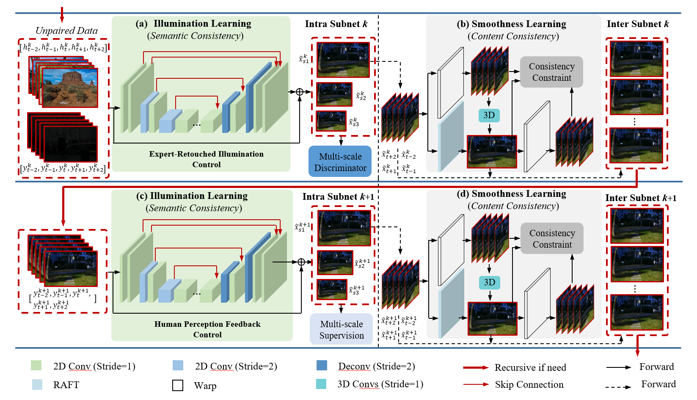
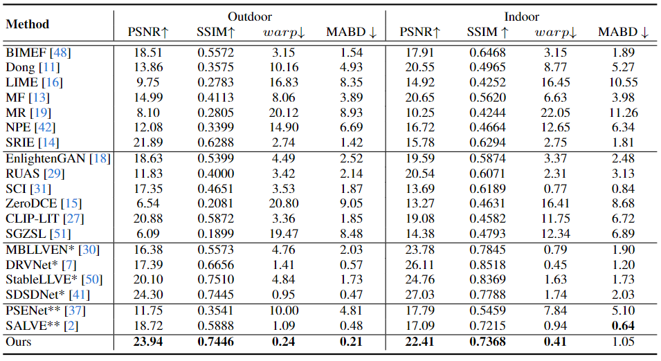

# [ECCV'24] UDU-NET
Official Pytorch implementation of **Unrolled Decomposed Unpaired Learning for Controllable Low-Light Video Enhancement**.

[Lingyu Zhu](https://scholar.google.com/citations?user=IhyTEDkAAAAJ&hl=zh-CN),
[Wenhan Yang](https://scholar.google.com/citations?user=S8nAnakAAAAJ&hl=zh-CN),
[Baoliang Chen](https://scholar.google.com/citations?user=w_WL27oAAAAJ&hl=zh-CN),
[Hanwei Zhu](https://scholar.google.com/citations?user=-52izjkAAAAJ&hl=zh-CN),
[Zhangkai Ni](https://scholar.google.com/citations?hl=zh-CN&user=68IcrE4AAAAJ),
[Qi Mao](https://scholar.google.com/citations?hl=zh-CN&user=VTQZF6EAAAAJ),
[Shiqi Wang](https://scholar.google.com/citations?user=Pr7s2VUAAAAJ&hl=zh-CN)


[[`Arxiv`](http://arxiv.org/abs/2408.12316)] [[`Project Page`]()] [[`Poster`](src/figures/ECCV_poster.png)] [[`Github`](https://github.com/lingyzhu0101/UDU_ECCV)]


## Overview
<p align="left">

</p>

Obtaining pairs of low/normal-light videos, with motions, is more challenging than still images, which raises technical issues and poses the technical route of unpaired learning as a critical role. This paper makes endeavors in the direction of learning for low-light video enhancement without using paired ground truth. Compared to low-light image enhancement, enhancing low-light videos is more difficult due to the intertwined effects of noise, exposure, and contrast in the spatial domain, jointly with the need for temporal coherence. To address the above challenge, we propose the Unrolled Decomposed Unpaired Network (UDU-Net) for enhancing low-light videos by unrolling the optimization functions into a deep network to decompose the signal into spatial and temporal-related factors, which are updated iteratively. Firstly, we formulate low-light video enhancement as a Maximum A Posteriori estimation (MAP) problem with carefully designed spatial and temporal visual regularization. Then, via unrolling the problem, the optimization of the spatial and temporal constraints can be decomposed into different steps and updated in a stage-wise manner. From the spatial perspective, the designed Intra subnet leverages unpair prior information from expert photography retouched skills to adjust the statistical distribution. Additionally, we introduce a novel mechanism that integrates human perception feedback to guide network optimization, suppressing over/under-exposure conditions. Meanwhile, to address the issue from the temporal perspective, the designed Inter subnet fully exploits temporal cues in progressive optimization, which helps achieve improved temporal consistency in enhancement results. Consequently, the proposed method achieves superior performance to state-of-the-art methods in video illumination, noise suppression, and temporal consistency across outdoor and indoor scenes.

## Qualitative Performance
<p align="left">

</p>


## Quantitative Performance
<p align="left">

</p>


## Public Dataset

We use the resized RGB image based on the [SDSD](https://github.com/dvlab-research/SDSD) dataset.

## Installation

First, install Python 3. We advise you to install Python 3 and PyTorch with Anaconda:

```
conda create --name py36 python=3.6
source activate py36
```

Clone the repo and install the complementary requirements:
```
cd $HOME
pip install -r requirements.txt
```

## Example Usage
### Train
Train the model on the corresponding dataset using the command, the training on outdoor subset of SDSD:
```
CUDA_VISIBLE_DEVICES=0 python main_step_single_stage_outdoor_abcd.py --mode train --version Video_outdoor_abcd --use_tensorboard True --is_test_psnr_ssim False --is_test_nima False 
```

### Test
Test the epoch xx on the corresponding dataset using the command, the testing on outdoor subset of SDSD:
```
CUDA_VISIBLE_DEVICES=0 python main_step_single_stage_outdoor_abcd.py --mode test --version Video_outdoor_abcd --use_tensorboard True --pretrained_model xx
```

We adopt PSNR and SSIM as comparison criteria to evaluate the spatial quality of enhanced video frames, which are based upon the implementations with MATLAB (R2018b).

## Contact

- Lingyu Zhu: lingyzhu-c@my.cityu.edu.hk

## Citation

If you find our work helpful, please consider citing:

```bibtex
@inproceedings{,
  title={Unrolled Decomposed Unpaired Learning for Controllable Low-Light Video Enhancement},
  author={Lingyu Zhu, Wenhan Yang, Baoliang Chen, Hanwei Zhu, Zhangkai Ni, Qi Mao, and Shiqi Wang},
  booktitle={European Conference on Computer Vision (ECCV)},
  year={2024}
}
```

## Additional Link

We also recommend our Temporally Consistent Enhancer Network [TCE-Net](https://github.com/lingyzhu0101/low-light-video-enhancement.git). If you find our work helpful, please consider citing:

```bibtex
@article{zhu2024temporally,
  title={Temporally Consistent Enhancement of Low-Light Videos via Spatial-Temporal Compatible Learning},
  author={Zhu, Lingyu and Yang, Wenhan and Chen, Baoliang and Zhu, Hanwei and Meng, Xiandong and Wang, Shiqi},
  journal={International Journal of Computer Vision},
  pages={1--21},
  year={2024},
  publisher={Springer}
}
```

## Acknowledgement

 - The optical flow model is adopted, and the trained model can be downloaded from the link [RAFT](https://github.com/princeton-vl/RAFT). We thank all authors for presenting such an excellent work.
